# 🤖 AutoGen Multi-Agent Coding Example

A comprehensive demonstration of collaborative AI coding using Microsoft's AutoGen framework with four specialized agents working together to solve programming tasks.

## 🎯 Overview

This project showcases how multiple AI agents can collaborate to create high-quality code through a structured workflow involving code generation, review, testing, and validation.

## 🤖 Meet the Agents

### 🧠 CodeAssistant
**Role**: Lead Python Developer
- Generates clean, efficient, and well-documented Python code
- Follows PEP 8 style guidelines and best practices
- Implements proper error handling and type hints
- Creates modular and reusable functions
- Provides comprehensive docstrings and documentation

### 🧐 CriticAgent
**Role**: Senior Code Reviewer
- Conducts thorough code reviews for bugs and security issues
- Suggests improvements for code quality and maintainability
- Ensures adherence to Python best practices
- Identifies edge cases and performance bottlenecks
- Recommends optimizations and refactoring strategies

### 🧪 TestAgent
**Role**: Quality Assurance Engineer
- Writes comprehensive unit tests using pytest
- Creates test cases for normal operations and edge scenarios
- Ensures high test coverage and code reliability
- Designs integration tests and validation scenarios
- Implements proper test fixtures and organization

### 🙋 UserProxyAgent
**Role**: Project Manager & Coordinator
- Initiates coding tasks and manages workflow
- Coordinates communication between agents
- Executes code and validates implementations
- Ensures final deliverables meet all requirements
- Manages the iterative improvement process

## 🚀 Quick Start

### Prerequisites
- **Python**: 3.8 or higher
- **OpenAI API Key**: Required for full functionality

### 1. Installation

```cmd
# Clone or navigate to the project directory

# Install required dependencies
pip install -r requirements.txt
```

### 2. API Key Setup

**Option A: Environment Variable**
```cmd
set OPENAI_API_KEY=your_actual_api_key_here
```

**Option B: Create .env file**
```
OPENAI_API_KEY=your_actual_api_key_here
```

### 3. Run the Example

**Interactive Quick Start (Recommended)**
```cmd
python quick_start.py
```

**Direct Execution**
```cmd
python multi_agent_coding_example.py
```

**Demo Mode (No API Key Required)**
```cmd
python simple_demo.py
```

## � Project Structure

```
autogen/
├── 📄 multi_agent_coding_example.py  # Main collaborative workflow
├── 🎭 simple_demo.py                 # Demo without API requirements
├── ⚡ quick_start.py                 # Interactive launcher with menu
├── 🏦 sample_output.py               # Example BankAccount implementation
├── 🧪 test_bank_account.py           # Comprehensive test suite
├── 📋 requirements.txt               # Python dependencies
├── 📖 README.md                      # This documentation
├── ⚙️  .env.template                 # Configuration template
└── 📁 autogen_workspace/             # Generated during execution
```

## � Collaborative Workflow

The agents follow this structured development process:

```mermaid
graph TD
    A[🙋 UserProxy: Define Task] --> B[🧠 CodeAssistant: Generate Initial Code]
    B --> C[🧐 CriticAgent: Review & Suggest Improvements]
    C --> D[🧠 CodeAssistant: Refine Implementation]
    D --> E[🧪 TestAgent: Write Comprehensive Tests]
    E --> F[🙋 UserProxy: Validate Final Solution]
    F --> G[✅ Complete Implementation]
```



### Example Task: BankAccount Class

**Requirements:**
- Account initialization and management
- Deposit and withdrawal operations with validation
- Money transfer between accounts
- Transaction logging and comprehensive error handling
- Type hints and full documentation

**Output:**
- ✅ Complete BankAccount class (200+ lines)
- ✅ Custom exception classes
- ✅ Transaction logging system
- ✅ 25+ comprehensive test cases
- ✅ 100% test coverage

## 🛠️ Usage Examples

### Basic Usage
```python
from multi_agent_coding_example import create_agents, setup_group_chat

# Create the four agents
agents = create_agents()
code_assistant, critic_agent, test_agent, user_proxy = agents

# Set up collaborative environment
manager = setup_group_chat(agents)

# Define your coding task
task = "Create a Calculator class with basic arithmetic operations"

# Start the collaboration
user_proxy.initiate_chat(manager, message=task)
```

### Custom Agent Configuration
```python
# Modify agent behavior
custom_config = {
    "config_list": [{"model": "gpt-4", "api_key": "your-key"}],
    "temperature": 0.5,  # More deterministic
    "timeout": 180,      # Longer timeout
}

# Apply to specific agents
code_assistant = autogen.AssistantAgent(
    name="CodeAssistant",
    system_message="Your custom instructions...",
    llm_config=custom_config,
)
```

## 🎯 Key Features

### 🏗️ **Collaborative Development**
- Multiple AI agents working together
- Structured communication and workflow
- Iterative improvement process

### 🔍 **Quality Assurance**
- Built-in code review process
- Comprehensive testing strategy
- Performance and security validation

### 📏 **Best Practices**
- PEP 8 compliance enforcement
- Type hints and documentation
- Error handling and edge cases

### 🧪 **Testing Excellence**
- Automated test generation
- High coverage requirements
- Integration test scenarios

### 🔧 **Developer Experience**
- Interactive quick start menu
- Detailed error messages
- Comprehensive documentation

## 🚀 Advanced Configuration

### Environment Variables
```bash
# Core Configuration
OPENAI_API_KEY=your_api_key_here
MODEL_NAME=gpt-4
TEMPERATURE=0.7
MAX_TOKENS=2000

# Workspace Settings
WORK_DIR=autogen_workspace
USE_DOCKER=false
```

### Custom Workflow
```python
# Extend with additional agents
documentation_agent = autogen.AssistantAgent(
    name="DocumentationAgent",
    system_message="Generate comprehensive documentation...",
    llm_config=llm_config,
)

# Add to group chat
groupchat = autogen.GroupChat(
    agents=[user_proxy, code_assistant, critic_agent, 
            test_agent, documentation_agent],
    max_round=20,
    speaker_selection_method="auto",
)
```

## � Learning Outcomes

After exploring this example, you'll understand:

- ✅ **Multi-agent AI collaboration** patterns
- ✅ **AutoGen framework** implementation
- ✅ **Structured code review** processes
- ✅ **Automated testing** strategies
- ✅ **AI-driven development** workflows

## 🐛 Troubleshooting

### Common Issues

**🔑 API Key Not Found**
```cmd
# Verify environment variable
echo %OPENAI_API_KEY%

# Set temporarily
set OPENAI_API_KEY=your_key_here
```

**📦 Module Import Errors**
```cmd
# Install dependencies
pip install -r requirements.txt

# Verify installation
python -c "import autogen; print('AutoGen installed successfully')"
```

**🔤 Encoding Issues**
- All files use UTF-8 encoding
- Run: `python quick_start.py` for automatic handling

### Getting Help

1. **Run the quick start menu**: `python quick_start.py`
2. **Check dependencies**: Option 1 in the menu
3. **View sample output**: Option 4 in the menu
4. **Test without API**: `python simple_demo.py`

## 🤝 Contributing

Extend this example by:

- 🔧 **Adding specialized agents** (SecurityAgent, DocumentationAgent)
- 🎯 **Implementing new tasks** (web scraping, data analysis)
- 🔄 **Enhancing workflows** (parallel processing, error recovery)
- 🧪 **Advanced testing** (performance, load testing)

## � Resources & References

- 📖 [AutoGen Documentation](https://microsoft.github.io/autogen/)
- 🔑 [OpenAI API Documentation](https://platform.openai.com/docs)
- 🐍 [Python Best Practices (PEP 8)](https://pep8.org/)
- 🧪 [pytest Testing Framework](https://docs.pytest.org/)
- 🏗️ [Microsoft AutoGen GitHub](https://github.com/microsoft/autogen)

## 📄 License

This example is provided for educational and demonstration purposes. Please comply with OpenAI's usage policies and terms of service when using their API.

---

**🎉 Happy Coding with AI Agents!** 

*Created with ❤️ to demonstrate the power of collaborative AI development*
